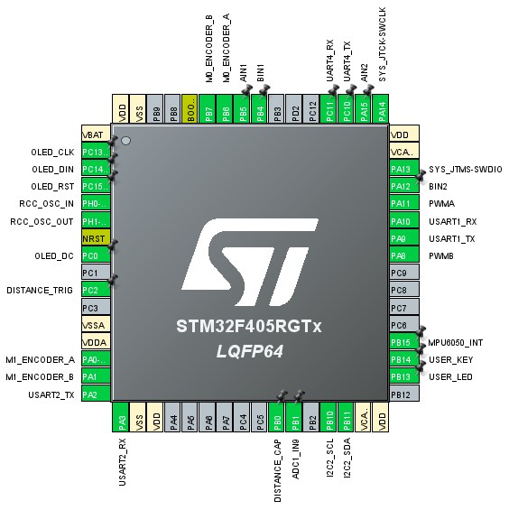

# nagi-stm32f4-wheel

[](https://www.gnu.org/licenses/gpl-3.0.en.html)

[English](README.md) | [中文](README_CN.md)

# Introduction
This project uses the hardware of the mini two-wheel balancing car based on STM32F405RGT6, released by [WHEELTEC](https://www.wheeltec.net/) in 2017, and completely re-implements the software part.

The supporting hardware is the STM32F4 main control board (due to the long time, the schematic diagram has been lost, only the pin definition diagram is attached here),



The motor drive module is TB6612FNG, and the 6-axis gyroscope and accelerometer are MPU6050.

The car control is divided into two main functions:

```c
static void balance_control(float *pwm) {
  // Calculate actual speed
  float actual_speed = (g_velocity[0] + g_velocity[1]) * 0.5f;
  // Calculate speed error
  float speed_error = BALANCE_SPEED - actual_speed + g_forward;

  // Calculate expected angle
  float expected_angle = -arm_pid_f32(&g_velocity_pid, speed_error);

  // Calculate angle error
  float angle_error = BALANCE_PITCH + expected_angle - g_pitch;

  // Calculate expected rate
  float expected_rate = arm_pid_f32(&g_pitch_angle_pid, angle_error);

  // Calculate rate error
  float rate_error = expected_rate - (g_gyro_pitch_rate);

  // Calculate PWM
  *pwm = arm_pid_f32(&g_pitch_rate_pid, rate_error);
}
```

Balance control uses a three-loop PID control, which are speed loop (position loop), pitch angle loop, and pitch angular velocity loop. It directly outputs the PWM signal to drive the motor.

```c
static void trun_control(float *pwm) {
  // Calculate yaw rate error
  float rate_error = 0.f - g_gyro_yaw_rate + g_turn_rate;

  // Calculate PWM
  *pwm = arm_pid_f32(&g_turn_pid, rate_error);
}
```

The steering control is very simple, using a single-loop PID.

Finally, the PWM output from the balance control is combined with simple addition and subtraction.

```c
g_motor_pwm[0] = pwm - trun;
g_motor_pwm[1] = pwm + trun;
```

## Development Environment

Use STM32CubeMX to open `nagi_stm32f4_wheel.ioc` and export the CMake project. Then use VSCode for development (STM32 extension needs to be installed).